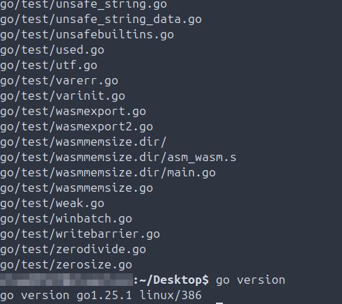

# Scope
Go code, debugging and CLI tooling.

## Deployments
**Summary:** This section covers anything misc related to this project, such as compiler installation and version validation.

- 2025-09-04 Install Go compiler locally and validate version.  
  

## Debugging
**Summary:** Code debugging.

- 2025-09-04 **DEBUGGING: Output of greeting code, error, caused by incorrectly using # instead of // (habit from Bash/Python), validate script is functioning correctly after correction.** 
  
- 2025-09-14 **DEBUGGING: Assigns an integer and a string data type to two different variables, then uses Printf to combine each into a string data type that is output to the terminal, along with intentionally outputting an error.**
  
- 2025-09-14 **DEBUGGING: Defines two constants, a third constant with a division equation, then prints a string, the result, and a second string to the terminal.**  
  
- 2025-09-17 **DEBUGGING: Defines two constants, a third constant with a division equation, when printing to the terminal this will intentionally cause an error due to mismatched datatypes.**
  
- 2025-09-28 **DEBUGGING: Code debugging/root cause analysis indicated the issue was using shorthand incorrectly as both the var and string were annotated, when the correct syntax was to use := and not annotate either of them.**
  
- 2025-10-03 **DEBUGGING: The subslice was calling the original array defined in the code that has string elements, not integers, and was slicing more elements then are defined.**
  
- 2025-10-03 **DEBUGGING: This array error is calling an index that is out of bounds of the element range in the array.**
  
- 2025-10-03 **DEBUGGING: len() was not included in the code for the array.**
  
- 2025-10-03 **DEBUGGING: This array error is calling an index that is out of bounds of the element range in the array.**
  
- 2025-10-10 **DEBUGGING: Slice range was equal for element substitution - corrected by selecting an element one index before the range termination**  
  
- 2025-11-19 **DEBUGGING: Output of singleValueMismatch code.**
  
- 2025-12-08 **DEBUGGING: Struct comparison was failing with "mismatched types JT and JTB" error when attempting to compare structs of different types using == operator. Resolution: Changed comparison to use same struct type (JTBA) for all variables.**  
  
- 2025-12-08 **DEBUGGING: Slice range was equal for element substitution - corrected by selecting an element one index before the range termination**  
  

## CLI Tooling
**Summary:** CLI tooling utilities that have been built, debugged and validated to work as intended.

2025-12-07 Built Go CLI tool for sales tax and tip calculations using closures and multiple return values. Demonstrates higher-order functions (functions that return functions), closures that capture state (tipTaxCalculator remembers ServiceType and tip slice), multiple return values from functions, struct field access from slice elements (tip[ServiceType].TipPercent), and clean user input handling with fmt.Scanf. Real-world application: calculates both tip and tax simultaneously for 9 service types (Restaurant, Bar, Delivery, Taxi, Haircut, Manicure, Pedicure, Tattoo, Hair Color/Cut) across the Seattle metro area with appropriate tip percentages and Seattle city sales tax rate (10.35%). Implemented using struct with three fields (ServiceType string, TipPercent float64, TaxRate float64), function returning closure with multiple float64 returns, and proper function signature matching with parentheses around return types. Key troubleshooting: missing closing braces, parentheses around multiple return types in function signatures, capturing all return values (cannot assign 2 values to 1 variable), and ensuring function signatures match exactly between caller and callee.
 

## Code
**Summary:** Go code. All code written in isolation for it's specific functionality.

- 2025-09-04 Outputs "Good Evening" to the terminal. `goodEvening.go`  
  [goodEvening.go](Code/Code/goodEvening.go)
- 2025-09-04 Output of goodEvening code.  
  
- 2025-09-06 Assigns a string statement to the time variable then outputs the string to the terminal. `author.go`  
  [author.go](Code/Code/author.go)
- 2025-09-06 Output of author code.  
  
- 2025-09-06 Assigns a string to two different variables, then joins a string to both variables and prints to the terminal. `nameLocationOpinion.go`  
  [nameLocationOpinion.go](Code/Code/nameLocationOpinion.go)
- 2025-09-06 Output of nameLocationOpinion code.  
  
- 2025-09-06 Calls the main function, assigns a string and a float to two different variables, then uses Printf to combine each in a string output to the terminal. `months.go`  
  [months.go](Code/Code/months.go)
- 2025-09-06 Output of months code.  
  
- 2025-09-07 Calls the main function, defines two string variables using shorthand and outputting each to the terminal on a seperate line. `shorthand.go`  
  [shorthand.go](Code/Code/shorthand.go)
- 2025-09-07 Output of shorthand code.  
  
- 2025-09-11 Calls the main function, defines three string variables, one in the outer block and two in the inner block using shorthand and outputting all to the terminal on seperate lines `outerInnerBlocks.go`  
  [outerInnerBlocks.go](Code/Code/outerInnerBlocks.go)
- 2025-09-11 Output of outer_inner_blocks code.  
  
- 2025-09-11 Do not assign a value to any of the data types defined in a variable, print to terminal which returns the default zero value for each `zeroValues.go`  
  [zeroValues.go](Code/Code/zeroValues.go)
- 2025-09-11 Output of zero_value code.  
  
- 2025-09-14 Assigns an integer and a float64 data type to two different variables, then uses Printf to combine each into an float64 datatype that is output to the terminal. `intToFloat64.go`  
  [intToFloat64.go](Code/Code/intToFloat64.go)
- 2025-09-14 Output of intToFloat64 code.  
  
- 2025-09-14 Assigns an integer and a float64 data type to two different variables, then uses Printf to combine each into a integer data type that is output to the terminal. `float64ToInt.go`  
  [float64ToInt.go](Code/Code/float64ToInt.go)
- 2025-09-14 Output of float64ToInt code.  
  
- 2025-09-14 Assigns an integer and a string data type to two different variables, then uses Printf to combine each into a string data type that is output to the terminal. `intToStr.go`  
  [intToStr.go](Code/Code/intToStr.go)
- 2025-09-14 Output of intToStr code.  
  
- 2025-09-20 Defines multiple string, float64 and integer variables, then, uses various arithmetic operators to execute basic mathematical operations. `arithmeticOperators.go`  
  [arithmeticOperators.go](Code/Code/arithmeticOperators.go)
- 2025-09-20 Output of arithmeticOperators code.  
  
- 2025-09-26 Defines two int variables, then executes the script using all five logical operators. `logicalOperators.go`  
  [logicalOperators.go](Code/Code/logicalOperators.go)
- 2025-09-26 Output of logicalOperators code.  
  
- 2025-09-26 Defines two int variables, then executes the script using all five assignment operators. `assignmentOperators.go`  
  [assignmentOperators.go](Code/Code/assignmentOperators.go)
- 2025-09-26 Output of assignmentOperators code.  
  
- 2025-09-26 Defines int variables, then executes the script using all five bitwise operators. `bitwiseOperators.go`  
  [bitwiseOperators.go](Code/Code/bitwiseOperators.go)
- 2025-09-26 Output of bitwiseOperators code.  
  
- 2025-09-28 Defines a string var, prints the results to the terminal. Then, defines a second string var, then executes against an if-else statement. Finally, defines a string var using shorthand, and prints a string to the terminal indicating the true statement for the three. `ifElseStatements.go`  
  [ifElseStatements.go](Code/Code/ifElseStatements.go)
- 2025-09-28 Output of ifElseStatements code.  
  
- 2025-09-28 Defines an int var, uses a switch-case operator, executes the case statement. Then, defines an int var that executes against multiple  case blocks finishing with printing the output to the terminal. Then, defines an int var, uses fallthrough, runs through each subsequent case block stopping at the first block not having fallthrough and prints that to the terminal. Finally, defines two int variables, runs through multiple case blocks without using fallthrough, and prints result to the terminal. `switchCase.go`  
  [switchCase.go](Code/Code/switchCase.go)
- 2025-09-28 Output of switchCase code.  
  
- 2025-09-30 Infinite loop that increments the jt var increasing by 1 each time and will not end until manually terminated. `infiniteLoop.go` 
  [infiniteLoop.go](Code/Code/infiniteLoop.go)
- 2025-09-30 Output of infiniteLoop code.  
  
- 2025-09-30 Defines an array and assigns values to all 3 strings. Defines a second array and assigns values to all 4 int. Defines a third array and assigns values to all 4 strings. Defines a fourth array, assigns values to all 3 strings, prints the name of the array, calls the element from index 2 (plums), also (array indexing) replaces the element at index 0 with another string and prints the updated array. Assign ints to an 8 element array, then runs a for loop through the ints provided until reaching the end. Defines a fifth array, forloop through the array and provides the element with the corresponding index location. Defines a sixth array, multidimensional - 2D, specifies the number of indexes as well as the number of elements per index, then calls the desired element from the specified index. `arrays.go`
  
- 2025-09-30 Output of arrays code.  
  
- 2025-10-03 Forloop and forloop break code. `forLoop.go`  
  [forLoop.go](Code/Code/forLoop.go)
- 2025-10-03 Output of forLoop script.  
  
- 2025-10-10 Advanced slice creation, capacity management, and element manipulation. Multiple slice operations derived from static arrays and dynamically allocated memory using make(). Validated slicing behavior with varying start and end indices, including nested slicing and subslice creation. Explored slice length (len) and capacity (cap) relationships, observing how underlying array references change upon modification. Appended elements to existing slices to observe automatic capacity expansion, concatenation using variadic syntax (append(sliceA, sliceB...)), and element removal through selective slicing and rejoining. Implemented data duplication with copy() and verified accurate element transfer. Iterated through slices using both indexed and range-based loops to confirm index–value pairing behavior.
 
- 2025-10-10 Complete map CRUD operations and iteration techniques. Creation, reading, updating, deletion, and iteration. Initialized key–value pairs using both string and integer types. Verified element existence using the comma–ok idiom (value, found := map[key]), validating map-safe lookups and zero-value return behavior for non-existent keys. Added and modified elements dynamically to test mutability, and used the built-in delete() function to remove individual entries. Implemented full map truncation using key-based iteration with deletion inside a for range loop, and zeroed the entire map through reinitialization with make(). Confirmed that maps are reference types with no guaranteed order of iteration.
 
- 2025-11-19 multipleValuesReturned script. `multipleValuesReturned.go`  
  [multipleValuesReturned.go](Code/Code/multipleValuesReturned.go)
- 2025-11-19 Output of multipleValuesReturned code.  
  
- 2025-11-19 multipleVariadicFunctions code. `multipleVariadicFunctions.go`  
  [multipleVariadicFunctions.go](Code/Code/multipleVariadicFunctions.go)
- 2025-11-19 Output of multipleVariadicFunctions code.  
  
- 2025-11-19 blankIdentifier code. `blankIdentifier.go`  
  [blankIdentifier.go](Code/Code/blankIdentifier.go)
- 2025-11-19 Output of blankIdentifier code.  
  
- 2025-11-19 factorialRecursive code. `factorialRecursive.go`  
  [factorialRecursive.go](Code/Code/factorialRecursive.go)
- 2025-11-19 Output of factorialRecursive script.  
  
- 2025-11-19 anonymousFunctions code. `annoymousFunctions.go`  
  [annoymousFunctions.go](Code/Code/annoymousFunctions.go)
- 2025-11-19 Output of annoymousFunctions code.  
  
- 2025-11-27 addressOperators code. `addressOperators.go`  
  [addressOperators.go](Code/Code/addressOperators.go)
- 2025-11-27 Output of addressOperators code - declaring and initializing pointers; dereferencing a pointer, etc.
  
- 2025-12-08 smithStruct code. `smithStruct.go`  
  [smithStruct.go](Code/Code/smithStruct.go)
- 2025-12-08 Struct comparison, instantiation methods (field-by-field and inline literal), slice of structs, iteration with range, Go-syntax formatting with %#v.
  

## Concurrency
**Summary:** Production safety and troubleshooting: Channels, Mutex, WaitGroups, Context - Race Conditions, Deadlocks, Infinite Loops.

- 2025-12-22 Outputs multiple buffered channels and boolean regarding if they are true or not. `closedChannels.go`  
  [closedChannels.go](Code/Code/closedChannels.go)
- 2025-12-22 Output of closedChannels code.  
    

- 2025-12-22 Outputs multiple buffered channels and boolean regarding if they are true or not. `timeOutCode.go`  
  [timeOutCode.go](Code/Code/timeOutCode.go)
- 2025-12-22 Output of timeOutCode code.  
    

- 2025-12-22 Outputs multiple buffered channels and boolean regarding if they are true or not. `unbufferedChannelForLoop.go`  
  [unbufferedChannelForLoop.go](Code/Code/unbufferedChannelForLoop.go)
- 2025-12-22 Output of unbufferedChannelForLoop code.  
    

- 2025-12-22 Outputs multiple buffered channels and boolean regarding if they are true or not. `mutex.go`  
  [mutex.go](Code/Code/mutex.go)
- 2025-12-22 Output of unmutex code.  
    