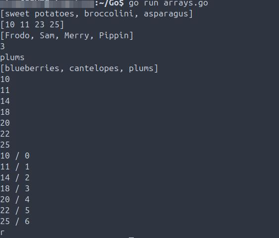
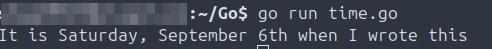
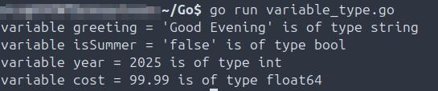
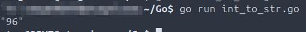
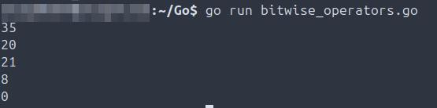

# Scope
Systematic Go language learning with scripts covering fundamentals to advanced concepts.

## Environment
Operating System: Ubuntu 24.04 LTS

Golang: 1.22.2
```
├── README.md
├── Code/                       # Go code with use case documentation
├── Screenshots/                # Visual documentation of all tasks
│   ├── Code/
│   ├── Misc/
│   ├── Scripts/
└── Scripts/                    # Go scripts with use case documentation

```
## Deployments
**Summary:** This section covers anything misc related to this project, such as compiler installation and version validation.

- 2025-09-04 Install Go compiler locally and validate version.  
  

## Code
**Summary:** This section includes all Go code written - also includes any applicable troubleshooting.

- 2025-09-30 Defines an array and assigns values to all 3 strings. Defines a second array and assigns values to all 4 int. Defines a third array and assigns values to all 4 strings. Defines a fourth array, assigns values to all 3 strings, prints the name of the array, calls the element from index 2 (plums), also (array indexing) replaces the element at index 0 with another string and prints the updated array. Assign ints to an 8 element array, then runs a for loop through the ints provided until reaching the end. Defines a fifth array, forloop through the array and provides the element with the corresponding index location. Defines a sixth array, multidimensional - 2D, specifies the number of indexes as well as the number of elements per index, then calls the desired element from the specified index. `arrays.go`
  
  
- 2025-09-30 Output of arrays code.  
  

- 2025-10-03 **TROUBLESHOOTING: The subslice was calling the original array defined in the code that has string elements, not integers, and was slicing more elements then are defined.**
  

- 2025-10-03 **TROUBLESHOOTING: This array error is calling an index that is out of bounds of the element range in the array.**
  

- 2025-10-03 **TROUBLESHOOTING: len() was not included in the code for the array.**
  

- 2025-10-03 **TROUBLESHOOTING: This array error is calling an index that is out of bounds of the element range in the array.**
  

- 2025-10-10 **TROUBLESHOOTING: Slice range was equal for element substitution - corrected by selecting an element one index before the range termination**  


- 2025-12-08 **TROUBLESHOOTING**: Struct comparison failed with "mismatched types JT and JTB" error when attempting to compare structs of different types using == operator. Resolution: Changed comparison to use the same struct type (JTBA) for all vars. 


- 2025-12-08 **TROUBLESHOOTING**: Struct field access failed with "j.color undefined (type smith has no field or method color)" error due to case sensitivity in field names. Resolution: Changed j.color to j.Color (capitalized) to match defined struct field name.


- 2025-10-10 Advanced slice creation, capacity management, and element manipulation. Multiple slice operations derived from static arrays and dynamically allocated memory using make(). Validated slicing behavior with varying start and end indices, including nested slicing and subslice creation. Explored slice length (len) and capacity (cap) relationships, observing how underlying array references change upon modification. Appended elements to existing slices to observe automatic capacity expansion, concatenation using variadic syntax (append(sliceA, sliceB...)), and element removal through selective slicing and rejoining. Implemented data duplication with copy() and verified accurate element transfer. Iterated through slices using both indexed and range-based loops to confirm index–value pairing behavior.
 

- 2025-10-10 Complete map CRUD operations and iteration techniques. Creation, reading, updating, deletion, and iteration. Initialized key–value pairs using both string and integer types. Verified element existence using the comma–ok idiom (value, found := map[key]), validating map-safe lookups and zero-value return behavior for non-existent keys. Added and modified elements dynamically to test mutability, and used the built-in delete() function to remove individual entries. Implemented full map truncation using key-based iteration with deletion inside a for range loop, and zeroed the entire map through reinitialization with make(). Confirmed that maps are reference types with no guaranteed order of iteration.
 
  
## Scripts
**Summary:** This section all scripts written in Go. Includes what they do and expected outcome, also includes any errors and debugging encountered.

- 2025-09-04 Outputs "Good Evening" to the terminal. `goodEvening.go`  
  [goodEvening.go](Scripts/Scripts/goodEvening.go)
- 2025-09-04 Output of goodEvening script.  
  
- 2025-09-04 Outputs "Hi, my name is Justin" to the terminal. `greeting.go`  
  [greeting.go](Scripts/Scripts/greeting.go)
- 2025-09-04 Output of greeting script, error, caused by incorrectly using # instead of // (habit from Bash/Python), validate script is functioning correctly after correction.  
  
- 2025-09-06 Assigns a string statement to the time variable then outputs the string to the terminal. `author.go`  
  [author.go](Scripts/Scripts/author.go)
- 2025-09-06 Output of author script.  
  
- 2025-09-06 Assigns a string to two different variables, then joins a string to both variables and prints to the terminal. `nameLocationOpinion.go`  
  [nameLocationOpinion.go](Scripts/Scripts/nameLocationOpinion.go)
- 2025-09-06 Output of nameLocationOpinion script.  
  
- 2025-09-06 Calls the main function, assigns a string and a float to two different variables, then uses Printf to combine each in a string output to the terminal. `months.go`  
  [months.go](Scripts/Scripts/months.go)
- 2025-09-06 Output of months script.  
  
- 2025-09-07 Calls the main function, defines two string variables using shorthand and outputting each to the terminal on a seperate line. `shorthand.go`  
  [shorthand.go](Scripts/Scripts/shorthand.go)
- 2025-09-07 Output of shorthand script.  
  
- 2025-09-11 Calls the main function, defines three string variables, one in the outer block and two in the inner block using shorthand and outputting all to the terminal on seperate lines `outerInnerBlocks.go`  
  [outerInnerBlocks.go](Scripts/Scripts/outerInnerBlocks.go)
- 2025-09-11 Output of outer_inner_blocks script.  
  
- 2025-09-11 Do not assign a value to any of the data types defined in a variable, print to terminal which returns the default zero value for each `zeroValues.go`  
  [zeroValues.go](Scripts/Scripts/zeroValues.go)
- 2025-09-11 Output of zero_value script.  
  
- 2025-09-14 Do not assign a value to any of the defined variables, print to the terminal, which then returns the default zero value for each. `dataTypes.go`  
  [dataTypes.go](Scripts/Scripts/dataTypes.go)
- 2025-09-14 Output of dataTypes script.  
  
- 2025-09-14 Defines a var of each data type, prints the output of the variables along with the associated data type to the terminal using the reflect.TypeOf function. `dataTypeSamples.go`  
  [dataTypeSamples.go](Scripts/Scripts/dataTypeSamples.go)
- 2025-09-14 Output of dataTypeSamplesscript.  
  
- 2025-09-14 Assigns an integer and a float64 data type to two different variables, then uses Printf to combine each into an float64 datatype that is output to the terminal. `intToFloat64.go`  
  [intToFloat64.go](Scripts/Scripts/intToFloat64.go)
- 2025-09-14 Output of intToFloat64 script.  
  
- 2025-09-14 Assigns an integer and a float64 data type to two different variables, then uses Printf to combine each into a integer data type that is output to the terminal. `float64ToInt.go`  
  [float64ToInt.go](Scripts/Scripts/float64ToInt.go)
- 2025-09-14 Output of float64ToInt script.  
  
- 2025-09-14 Assigns an integer and a string data type to two different variables, then uses Printf to combine each into a string data type that is output to the terminal. `intToStr.go`  
  [intToStr.go](Scripts/Scripts/intToStr.go)
- 2025-09-14 Output of intToStr script.  
  
- 2025-09-14 Assigns a string and integer data type to two different variables, then uses Atoi to convert the str to an int on the terminal along with the data type, also returns there are not any errors. `strIntAtoi.go`  
  [strIntAtoi.go](Scripts/Scripts/strIntAtoi.go)
- 2025-09-14 Output of strIntAtoi script.  
  
- 2025-09-14 Assigns an integer and a string data type to two different variables, then uses Printf to combine each into a string data type that is output to the terminal, along with intentionally outputting an error. `strIntErr.go`  
  [strIntErr.go](Scripts/Scripts/strIntErr.go)
- 2025-09-14 Output of strIntErr script.  
  
- 2025-09-14 Defines two constants, a third constant with a division equation, then prints a string, the result, and a second string to the terminal. `constants.go`  
  [constants.go](Scripts/Scripts/constants.go)
- 2025-09-14 Output of constants script.  
  
- 2025-09-17 Defines two constants, a third constant with a division equation, when printing to the terminal this will intentionally cause an error due to mismatched datatypes. `constantsError.go`  
  [constantsError.go](Scripts/Scripts/constantsError.go)
- 2025-09-17 Output of constantsError script.  
  
- 2025-09-17 Defines six variables, two string, four integer, and utilizes all six comparison operators to return the expected boolean values to the terminal. `comparisonOperators.go`    
  [comparisonOperators.go](Scripts/Scripts/comparisonOperators.go)
- 2025-09-17 Output of comparisonOperators script.  
  
- 2025-09-20 Defines multiple string, float64 and integer variables, then, uses various arithmetic operators to execute basic mathematical operations. `arithmeticOperators.go`  
  [arithmeticOperators.go](Scripts/Scripts/arithmeticOperators.go)
- 2025-09-20 Output of arithmeticOperators script.  
  
- 2025-09-26 Defines two int variables, then executes the script using all five logical operators. `logicalOperators.go`  
  [logicalOperators.go](Scripts/Scripts/logicalOperators.go)
- 2025-09-26 Output of logicalOperators script.  
  
- 2025-09-26 Defines two int variables, then executes the script using all five assignment operators. `assignmentOperators.go`  
  [assignmentOperators.go](Scripts/Scripts/assignmentOperators.go)
- 2025-09-26 Output of assignmentOperators script.  
  
- 2025-09-26 Defines int variables, then executes the script using all five bitwise operators. `bitwiseOperators.go`  
  [bitwiseOperators.go](Scripts/Scripts/bitwiseOperators.go)
- 2025-09-26 Output of bitwiseOperators script.  
  
- 2025-09-28 Defines a string var, prints the results to the terminal. Then, defines a second string var, then executes against an if-else statement. Finally, defines a string var using shorthand, and prints a string to the terminal indicating the true statement for the three. `ifElseStatements.go`  
  [ifElseStatements.go](Scripts/Scripts/ifElseStatements.go)
- 2025-09-28 Output of ifElseStatements script.  
  
- 2025-09-28 **TROUBLESHOOTING: Code debugging/root cause analysis indicated the issue was using shorthand incorrectly as both the var and string were annotated, when the correct syntax was to use := and not annotate either of them.**
  
- 2025-09-28 Defines an int var, uses a switch-case operator, executes the case statement. Then, defines an int var that executes against multiple  case blocks finishing with printing the output to the terminal. Then, defines an int var, uses fallthrough, runs through each subsequent case block stopping at the first block not having fallthrough and prints that to the terminal. Finally, defines two int variables, runs through multiple case blocks without using fallthrough, and prints result to the terminal. `switchCase.go`  
  [switchCase.go](Scripts/Scripts/switchCase.go)
- 2025-09-28 Output of switchCase script.  
  
- 2025-09-30 Infinite loop that increments the jt var increasing by 1 each time and will not end until manually terminated. `infiniteLoop.go` 
  [infiniteLoop.go](Scripts/Scripts/infiniteLoop.go)
- 2025-09-30 Output of infiniteLoop script.  
  
- 2025-10-03 **TROUBLESHOOTING: The wrong variable is being called while the for loop is running.**
  
- 2025-10-03 Forloop and forloop break script. `forLoop.go`  
  [forLoop.go](Scripts/Scripts/forLoop.go)
- 2025-10-03 Output of forLoop script.  
  
- 2025-11-19 singleValueMismatch script. `singleValueMismatch.go`  
  [singleValueMismatch.go](Scripts/Scripts/singleValueMismatch.go)
- 2025-11-19 Output of singleValueMismatch script.  
  
- 2025-11-19 multipleValuesReturned script. `multipleValuesReturned.go`  
  [multipleValuesReturned.go](Scripts/Scripts/multipleValuesReturned.go)
- 2025-11-19 Output of multipleValuesReturned script.  
  
- 2025-11-19 multipleVariadicFunctions script. `multipleVariadicFunctions.go`  
  [multipleVariadicFunctions.go](Scripts/Scripts/multipleVariadicFunctions.go)
- 2025-11-19 Output of multipleVariadicFunctions script.  
  
- 2025-11-19 blankIdentifier script. `blankIdentifier.go`  
  [blankIdentifier.go](Scripts/Scripts/blankIdentifier.go)
- 2025-11-19 Output of blankIdentifier script.  
  
- 2025-11-19 factorialRecursive script. `factorialRecursive.go`  
  [factorialRecursive.go](Scripts/Scripts/factorialRecursive.go)
- 2025-11-19 Output of factorialRecursive script.  
  
- 2025-11-19 anonymousFunctions script. `annoymousFunctions.go`  
  [annoymousFunctions.go](Scripts/Scripts/annoymousFunctions.go)
- 2025-11-19 Output of annoymousFunctions script.  
  
- 2025-11-27 addressOperators script. `addressOperators.go`  
  [addressOperators.go](Scripts/Scripts/addressOperators.go)
- 2025-11-27 Output of addressOperators script - declaring and initializing pointers; dereferencing a pointer, etc.
  
