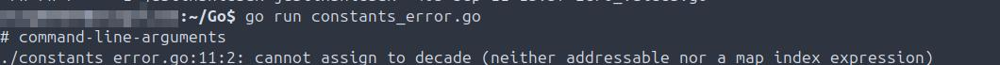
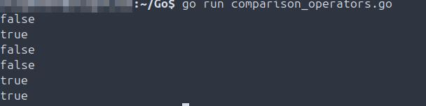

# Scope
Systematic Go language learning with scripts covering fundamentals to advanced concepts.

## Environment
Operating System: Ubuntu 24.04 LTS

Golang: 1.22.2
```
├── README.md
├── Code/                       # Go code with use case documentation
├── Screenshots/                # Visual documentation of all tasks
│   ├── Code/
│   ├── Misc/
│   ├── Scripts/
└── Scripts/                    # Go scripts with use case documentation

```
## Deployments
**Summary:** This section covers anything misc related to this project, such as compiler installation and version validation.

- 2025-09-04 Install Go compiler locally and validate version.  
  

## Code
**Summary:** This section includes all Go code written - also includes any applicable troubleshooting.

- 2025-09-30 Defines an array and assigns values to all 3 strings. Defines a second array and assigns values to all 4 int. Defines a third array and assigns values to all 4 strings. Defines a fourth array, assigns values to all 3 strings, prints the name of the array, calls the element from index 2 (plums), also (array indexing) replaces the element at index 0 with another string and prints the updated array. Assign ints to an 8 element array, then runs a for loop through the ints provided until reaching the end. Defines a fifth array, forloop through the array and provides the element with the corosponding index location. Defines a sixth array, muiltidimensional - 2D, specifies the number of indexes as well as the number of elements per index, then calls the desired element from the specified index. `arrays.go`
[arrays.go](Code/Code/arrays.go)
- 2025-09-30 Output of arrays code.  


## Scripts
**Summary:** This section all scripts written in Go. Includes what they do and expected outcome, also includes any errors and debugging encountered.

- 2025-09-04 Outputs "Good Evening" to the terminal. `good-evening.go`  
  [good-evening.go](Scripts/Scripts/good-evening.go)
- 2025-09-04 Output of good-evening script.  
  
- 2025-09-04 Outputs "Hi, my name is Justin" to the terminal. `greeting.go`  
  [greeting.go](Scripts/Scripts/greeting.go)
- 2025-09-04 Output of greeting script, error, caused by incorrectly using # instead of // (habit from Bash/Python), validate script is functioning correctly after correction.  
  
- 2025-09-06 Outputs "The weather is nice today" to the terminal. `weather.go`  
  [weather.go](Scripts/Scripts/weather.go)
- 2025-09-06 Output of weather script.  
  
- 2025-09-06 Assigns a string statement to the time variable then outputs the string to the terminal. `time.go`  
  [time.go](Scripts/Scripts/time.go)
- 2025-09-06 Output of weather script.  
  
- 2025-09-06 Assigns a string to two different variables, then joins a string to both variables and prints to the terminal. `name-location-opinion.go`  
  [name-location-opinion.go](Scripts/Scripts/name-location-opinion.go)
- 2025-09-06 Output of name-location-opinion script.  
  
- 2025-09-06 Assigns a string to three different variables, then prints all three to the terminal, with each being printed to a newline on the terminal via the newline character. `name-location-opinion-newline.go`  
  [name-location-opinion-newline.go](Scripts/Scripts/name-location-opinion-newline.go)
- 2025-09-06 Output of name-location-opinion-newline script.  
  
- 2025-09-06 Assigns a string to three different variables, then prints all three to the terminal, with each being printed to a newline on the terminal via the Println function. `name-location-opinion-println.go`  
  [name-location-opinion-println.go](Scripts/Scripts/name-location-opinion-println.go)
- 2025-09-06 Output of name-location-opinion-println script.  
  
- 2025-09-06 Calls the main function, assigns a string and a float to two different variables, then uses Printf to combine each in a string output to the terminal. `months.go`  
  [months.go](Scripts/Scripts/months.go)
- 2025-09-06 Output of months script.  
  
- 2025-09-07 Calls the main function, defines two string variables using shorthand and outputting each to the terminal on a seperate line. `shorthand.go`  
  [shorthand.go](Scripts/Scripts/shorthand.go)
- 2025-09-07 Output of shorthand script.  
  
- 2025-09-10 Calls the main function, define two string variables and one integer variable using shorthand and outputting each to the terminal on a seperate line. `shorthand_expanded.go`  
  [shorthand_expanded.go](Scripts/Scripts/shorthand_expanded.go)
- 2025-09-10 Output of shorthand_expanded script.  
  
- 2025-09-11 Calls the main function, defines three string variables, one in the outer block and two in the inner block using shorthand and outputting all to the terminal on seperate lines `outer_inner_blocks.go`  
  [outer_inner_blocks.go](Scripts/Scripts/outer_inner_blocks.go)
- 2025-09-11 Output of outer_inner_blocks script.  
  
- 2025-09-11 Do not assign a value to any of the data types defined in a variable, print to terminal which returns the default zero value for each `zero_values.go`  
  [zero_values.go](Scripts/Scripts/zero_values.go)
- 2025-09-11 Output of zero_value script.  
  
- 2025-09-11 Defines (3) string vars, (1) bool var and (1) float64 var. Then, prints each var on a new line requesting the user enter the desired input matched per data type. `user_input.go`  
  [user_input.go](Scripts/Scripts/user_input.go)
- 2025-09-11 Output of user_input script.  
  
- 2025-09-14 Do not assign a value to any of the defined variables, print to the terminal, which then returns the default zero value for each. `variable_types.go`  
  [variable_types.go](Scripts/Scripts/variable_types.go)
- 2025-09-14 Output of variable_types script.  
  
- 2025-09-14 Defines a var of each data type, prints the output of the variables along with the associated data type to the terminal using the reflect.TypeOf function. `variable_types_typeof.go`  
  [variable_types_typeof.go](Scripts/Scripts/variable_types_typeof.go)
- 2025-09-14 Output of variable_types_typeof script.  
  
- 2025-09-14 Assigns an integer and a float64 data type to two different variables, then uses Printf to combine each into an float64 datatype that is output to the terminal. `int_to_float64.go`  
  [int_to_float64.go](Scripts/Scripts/int_to_float64.go)
- 2025-09-14 Output of int_to_float64 script.  
  
- 2025-09-14 Assigns an integer and a float64 data type to two different variables, then uses Printf to combine each into a integer data type that is output to the terminal. `float64_to_int.go`  
  [float64_to_int.go](Scripts/Scripts/float64_to_int.go)
- 2025-09-14 Output of float64_to_int script.  
  
- 2025-09-14 Assigns an integer and a string data type to two different variables, then uses Printf to combine each into a string data type that is output to the terminal. `int_to_str.go`  
  [int_to_str.go](Scripts/Scripts/int_to_str.go)
- 2025-09-14 Output of int_to_str script.  
  
- 2025-09-14 Assigns a string and integer data type to two different variables, then uses Atoi to convert the str to an int on the terminal along with the data type, also returns there are not any errors. `str_to_int_noerr.go`  
  [str_to_int_noerr.go](Scripts/Scripts/str_to_int_noerr.go)
- 2025-09-14 Output of str_to_int_noerr script.  
  
- 2025-09-14 Assigns an integer and a string data type to two different variables, then uses Printf to combine each into a string data type that is output to the terminal, along with intentionally outputting an error. `str_to_int_err.go`  
  [str_to_int_err.go](Scripts/Scripts/str_to_int_err.go)
- 2025-09-14 Output of str_to_int_err script.  
  
- 2025-09-14 Defines two constants, a third constant with a division equation, then prints a string, the result, and a second string to the terminal. `constants.go`  
  [constants.go](Scripts/Scripts/constants.go)
- 2025-09-14 Output of constants script.  
  
- 2025-09-17 Defines two constants, a third constant with a division equation, when printing to the terminal this will intentionally cause an error due to mismatched datatypes. `constants_error.go`  
  [contants_error.go](Scripts/Scripts/constants_error.go)
- 2025-09-17 Output of constants_error script.  
  
- 2025-09-17 Defines two constants, a third constant with a division equation, then prints the result, which causes an intentional error as the int variable is not defined. `constants_error_2.go`  
  [contants_error_2.go](Scripts/Scripts/constants_error_2.go)
- 2025-09-17 Output of constants_error_2 script.  
  
- 2025-09-17 Defines six variables, two string, four integar, and utilizes all six comparison operators to return the expected boolean values to the terminal. `comparison_operators.go`    
  [comparison_operators.go](Scripts/Scripts/comparison_operators.go)
- 2025-09-17 Output of comparison_operators script.  
  
- 2025-09-20 Defines multiple string, float64 and integer variables, then, uses various arithmatic operators to execute basic mathematical operations. `arithmatic_operators.go`  
  [arithmatic_operators.go](Scripts/Scripts/arithmatic_operators.go)
- 2025-09-20 Output of arithmatic_operators script.  
  
- 2025-09-26 Defines two int variables, then executes the script using all five logical operators. `logical_operators.go`  
  [logical_operators.go](Scripts/Scripts/logical_operators.go)
- 2025-09-26 Output of logical_operators script.  
  
- 2025-09-26 Defines two int variables, then executes the script using all five assignment operators. `assignment_operators.go`  
  [assignment_operators.go](Scripts/Scripts/assignment_operators.go)
- 2025-09-26 Output of logical_operators script.  
  
- 2025-09-26 Defines int variables, then executes the script using all five bitwise operators. `bitwise_operators.go`  
  [bitwise_operators.go](Scripts/Scripts/bitwise_operators.go)
- 2025-09-26 Output of logical_operators script.  
  
- 2025-09-28 Defines a string var, prints the results to the terminal. Then, defines a second string var, then executes against an if-else statement. Finally, defines a string var using shorthand, and prints a string to the terminal indicating the true statement for the three. `if_else_statements.go`  
  [if_else_statements.go](Scripts/Scripts/if_else_statements.go)
- 2025-09-28 Output of if_else_statements script.  
  
- 2025-09-28 TROUBLESHOOTING: Code debugging/root cause analysis indicated the issue was using shorthand incorrectly as both the var and string were annotated, when the correct syntax was to use := and not annotate either of them.
  
- 2025-09-28 Defines an int var, uses a switch-case operator, executes the case statement. Then, defines an int var that executes against multiple  case blocks finishing with printing the output to the terminal. Then, defines an int var, uses fallthrough, runs through each subsequent case block stopping at the first block not having fallthrough and prints that to the terminal. Finally, defines two int variables, runs through multiple case blocks without using fallthrough, and prints result to the terminal. `switch_case.go`  
  [switch_case.go](Scripts/Scripts/switch_case.go)
- 2025-09-28 Output of switch_case script.  
  
- 2025-09-30 Infinite loop that increments the jt var increasing by 1 each time and will not end until manually terminated. `infinite_loop.go`  
  [infinite_loop.go](Scripts/Scripts/infinite_loop.go)
- 2025-09-30 Output of infinite_loop script.  
  
