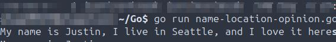

# Scope
Go scripts and code - writen, tested and debuged.

## Environment
Operating System: Ubuntu 24.04 LTS

Golang: 1.22.2
```
├── README.md
├── Code/                       # Go code with use case documentation
├── Screenshots/                # Visual documentation of all tasks
│   ├── Code/
│   ├── Misc/
│   ├── Scripts/
└── Scripts/                    # Go scripts with use case documentation

```
## Deployments
**Summary:** This section covers anything misc related to this project, such as compiler installation and version validation.

- 2025-09-04 Install Go compiler locally and validate version.  
  

## Code
**Summary:** This section covers anything misc related to this project, such as compiler installation and version validation.

## Scripts
**Summary:** This section all scripts written in Go. Includes what they do and expected outcome, also includes any errors and debugging encountered.

- 2025-09-04 Outputs "Good Evening" to the terminal. `good-evening.go`  
  [good-evening.go](Scripts/Scripts/good-evening.go)
- 2025-09-04 Output of good-evening script.  
  
- 2025-09-04 Outputs "Hi, my name is Justin" to the terminal. `greeting.go`  
  [greeting.go](Scripts/Scripts/greeting.go)
- 2025-09-04 Output of greeting script, error, caused by incorrectly using # instead of // (habit from Bash/Python), validate script is functioning correctly after correction.  
  
- 2025-09-06 Outputs "The weather is nice today" to the terminal. `weather.go`  
  [weather.go](Scripts/Scripts/weather.go)
- 2025-09-06 Output of weather script.  
  
- 2025-09-06 Assigns a string statement to the time variable then outputs the string to the terminal. `time.go`  
  [time.go](Scripts/Scripts/time.go)
- 2025-09-06 Output of weather script.  
  
- 2025-09-06 Assigns a string to two different variables, then joins a string to both variables and prints to the terminal. `name-location-opinion.go`  
  [name-location-opinion.go](Scripts/Scripts/name-location-opinion.go)
- 2025-09-06 Output of name-location-opinion script.  
  
- 2025-09-06 Assigns a string to three different variables, then prints all three to the terminal, with each being printed to a newline on the terminal via the newline character. `name-location-opinion-newline.go`  
  [name-location-opinion-newline.go](Scripts/Scripts/name-location-opinion-newline.go)
- 2025-09-06 Output of name-location-opinion-newline script.  
  
- 2025-09-06 Assigns a string to three different variables, then prints all three to the terminal, with each being printed to a newline on the terminal via the Println function. `name-location-opinion-println.go`  
  [name-location-opinion-println.go](Scripts/Scripts/name-location-opinion-println.go)
- 2025-09-06 Output of name-location-opinion-println script.  
  
- 2025-09-06 Calls the main function, assigns a string and a float to two different variables, then uses Printf to combine each in a string output to the terminal. `months.go`  
  [months.go](Scripts/Scripts/months.go)
- 2025-09-06 Output of months script.  
  
- 2025-09-07 Calls the main function, defines two string variables using shorthand and outputting each to the terminal on a seperate line. `shorthand.go`  
  [shorthand.go](Scripts/Scripts/shorthand.go)
- 2025-09-07 Output of shorthand script.  
  
- 2025-09-10 Calls the main function, define two string variables and one integer variable using shorthand and outputting each to the terminal on a seperate line. `shorthand_expanded.go`  
  [shorthand_expanded.go](Scripts/Scripts/shorthand_expanded.go)
- 2025-09-10 Output of shorthand_expanded script.  
  
- 2025-09-11 Calls the main function, defines three string variables, one in the outer block and two in the inner block using shorthand and outputting all to the terminal on seperate lines `outer_inner_blocks.go`  
  [outer_inner_blocks.go](Scripts/Scripts/outer_inner_blocks.go)
- 2025-09-11 Output of outer_inner_blocks script.  
  
- 2025-09-11 Do not assign a value to any of the data types defined in a variable, print to terminal which returns the default zero value for each `zero_values.go`  
  [zero_values.go](Scripts/Scripts/zero_values.go)
- 2025-09-11 Output of zero_value script.  
  
- 2025-09-11 Defines (3) string vars, (1) bool var and (1) float64 var. Then, prints each var on a new line requesting the user enter the desired input matched per data type. `user_input.go`  
  [user_input.go](Scripts/Scripts/user_input.go)
- 2025-09-11 Output of user_input script.  
  
